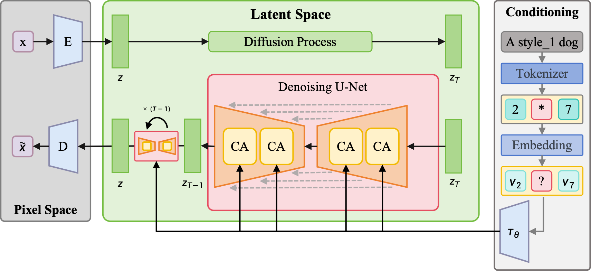
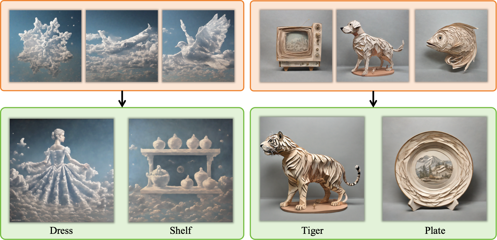

# 基于Text Inversion的风格迁移图片生成方法

## 简介

本项目是“不玩了，走了”队伍在参与第四届计图人工智能挑战赛，赛道二-风格迁移图片生成赛题的代码实现。

本项目使用了文本反演结合模型微调的方法，将新的图片风格注入生成模型，并建立新的单词与新风格之间的映射，然后通过结合主体内容和风格提示的方法来生成指定内容和风格的图片。

### 模型结构



### 结果展示


## 运行环境

+ ubuntu 20.04.2 LTS
+ python >= 3.9
+ jittor >= 1.3.9

## 环境安装

```bash
pip install git+https://github.com/JittorRepos/jittor
pip install git+https://github.com/JittorRepos/jtorch
pip install git+https://github.com/JittorRepos/diffusers_jittor
pip install git+https://github.com/JittorRepos/transformers_jittor
```

或者

```bash
pip install -r requirement.txt
```
### 2. 安装 JDiffusion
```bash
cd JDiffusion
pip install -e .
```

## 数据准备
```
${ROOT}
 -- dataset
     -- TrainB
         |-- 00
         |-- 01
         |-- 02
         ...

```

## 训练和测试
本项目在1张A100运行，单个风格训练时间约为8分钟

```
### train
sh train.sh

### test
sh test.sh

```
## 联系方式
jcwang@stu.ecnu.edu.cn
